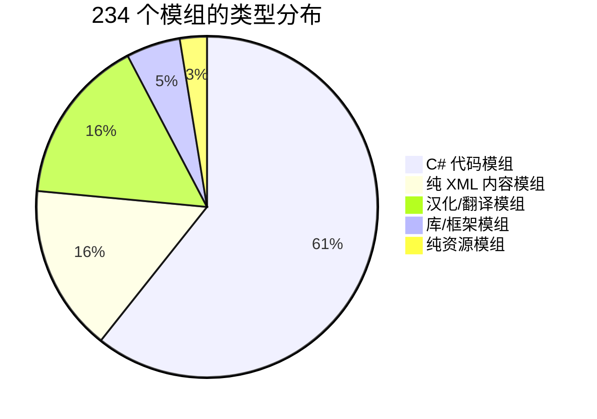
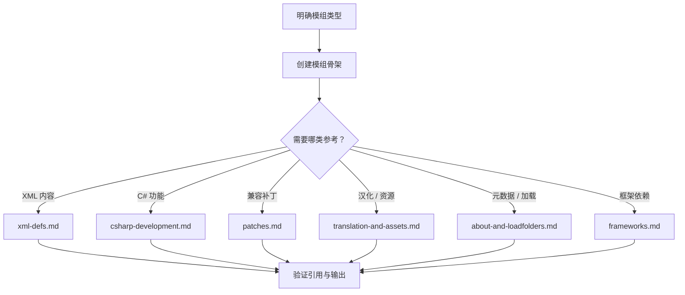

# RimWorld Mod Creator

> 一个面向 TRAE 的 RimWorld 模组制作技能。基于对 234 个 Steam 创意工坊模组的逆向工程分析，把散落在 wiki、论坛帖子和他人源码里的模组制作经验，提炼成一套结构化、可按需加载的知识体系。

RimWorld 的模组生态庞大，但官方文档有限，真正可靠的制作知识往往要靠阅读别人的源码和反复试错才能积累。这个技能把从 234 个真实工坊模组中统计出的约定、范式和坑点固化下来，让 AI 助手在用户提出模组制作需求时，能直接调取对应领域的准确参考，而不是凭模糊记忆拼凑。

## 核心能力

技能覆盖四种主流模组类型的完整制作链路，从模组骨架搭建到引用校验：

| 模组类型 | 必需文件 | 典型场景 |
|----------|---------|---------|
| 纯 XML 内容 | `About/About.xml` + `Defs/*.xml` + `Textures/` | 新增物品、建筑、武器、研究项目 |
| C# 功能 | 上述 + `Source/*.cs` + `版本/Assemblies/*.dll` | 修改游戏行为、自定义逻辑 |
| 兼容补丁 | `About/About.xml` + `Patches/*.xml` | 让两个 mod 协同工作 |
| 汉化 | `About/About.xml` + `Languages/` | 翻译现有 mod |

每一种类型都配套对应的目录约定与验证要点。例如 C# 模组必须声明 `brrainz.harmony` 依赖、编译输出落到版本子目录的 `Assemblies/`；汉化包则用 `loadAfter` 指向原 mod、`DefInjected` 子目录名必须与 Def 类型名完全一致。这些从真实模组中归纳出的约束，能避免模组无法加载或运行时崩溃。

## 知识来源

技能中的每一条约定和代码示例都不是凭空编写，而是来自对 234 个工坊模组的实际拆解。统计结果让技能知道什么才是"主流做法"，而非个例。



几个有代表性的发现：约 60.7% 的模组含 C# 代码，是功能实现的主力；约 70% 的 C# 模组依赖 Harmony（`brrainz.harmony`），它事实上是 C# 模组的基石；`loadAfter` 是最常见的加载顺序声明，出现在 74% 的模组中。技能内的框架清单、DLC packageId、高频被依赖项，都源自这些统计。

## 参考文档

技能在运行时按需加载 `references/` 下的六份深度参考，每份聚焦一个领域：

| 文档 | 覆盖内容 |
|------|---------|
| `about-and-loadfolders.md` | `About.xml` 全字段说明、字段使用统计、`LoadFolders.xml` 条件加载机制与四种写法 |
| `xml-defs.md` | 16 种常见 Def 类型、`ParentName` 继承机制、引用关系、代表性 Def 示例 |
| `csharp-development.md` | SDK-style 项目配置、三种 Mod 入口模式、Harmony Patch 写法、ModSettings、自定义 Def/ThingComp、跨版本兼容 |
| `patches.md` | 8 种 PatchOperation、XPath 用法、兼容补丁标准范式 |
| `translation-and-assets.md` | Keyed/DefInjected 翻译系统、贴图路径规则、`graphicClass` 渲染类型、音效 |
| `frameworks.md` | 12 个框架库清单、NuGet 包、DLC packageId、模组类型分布统计 |

所有代码示例取自真实模组（BionicIcons、Gunplay、yayoAni、Pick Up And Haul、EqualMilking、Ratkin），已在工坊目录中验证过写法的正确性。

## 工作流程

技能在接到模组制作需求后，按以下流程推进，根据模组类型动态决定加载哪份参考：



验证环节会检查 `texPath` 引用的贴图是否存在、Def 间的 `<li>` 引用是否指向已定义的 Def、C# 编译产物是否落到正确目录，避免最常见的加载失败。

## 仓库结构

```
.
├── rimworld-mod-creator/        # TRAE 技能本体
│   ├── SKILL.md                 # 技能入口与工作流程定义
│   └── references/              # 六份按需加载的深度参考
│       ├── about-and-loadfolders.md
│       ├── csharp-development.md
│       ├── frameworks.md
│       ├── patches.md
│       ├── translation-and-assets.md
│       └── xml-defs.md
└── rimworld-mod-guide/          # 完整 HTML 指南（离线可读）
    └── rimworld-mod-guide.html.zip
```

`SKILL.md` 是技能的入口文件，定义了适用场景、工作流程和关键约定速查；`references/` 下的文档由技能在运行时按需加载，普通用户无需手动查阅。`rimworld-mod-guide` 是同一套知识的独立 HTML 合集，解压后可在浏览器中通读。

## 如何使用

本技能面向 TRAE 平台。将 `rimworld-mod-creator` 目录放入 TRAE 的技能加载路径后，技能会被自动识别。之后用自然语言描述需求即可触发，无需记忆任何命令。

触发示例：

- "帮我做一个 RimWorld 模组，新增一把中世纪弩"
- "给这个 mod 写一个 Harmony patch，修改投射物速度"
- "做一个 Ratkin 和 Facial Animation 的兼容补丁"
- "把这个 mod 汉化成简体中文"
- "About.xml 里 loadAfter 应该怎么写"

技能会先判断模组类型，再加载对应参考，最终产出符合工坊规范的文件结构与代码。

## 一段最小示例

新增一把中世纪弩，只需一个 `ThingDef`，继承自原版或自定义基类：

```xml
<ThingDef ParentName="RK_NeolithicRangeWeapon">
  <defName>RK_Crossbow</defName>
  <label>cross bow</label>
  <graphicData>
    <texPath>Weapon/RK_Crossbow</texPath>
    <graphicClass>Graphic_Single</graphicClass>
  </graphicData>
  <costList><WoodLog>40</WoodLog><Steel>20</Steel></costList>
  <statBases>
    <WorkToMake>2400</WorkToMake>
    <RangedWeapon_Cooldown>1.2</RangedWeapon_Cooldown>
  </statBases>
  <verbs>
    <li>
      <verbClass>Verb_Shoot</verbClass>
      <defaultProjectile>Bolt_RK_Crossbow</defaultProjectile>
      <warmupTime>1.4</warmupTime>
      <range>22.9</range>
      <soundCast>Bow_Small</soundCast>
    </li>
  </verbs>
  <tools>
    <li><label>limb</label><power>9</power></li>
  </tools>
</ThingDef>
```

`texPath` 相对 `Textures/` 目录、不带扩展名、用正斜杠分隔；`defaultProjectile` 指向另定义的投射物 Def。这类约定在 `xml-defs.md` 与 `translation-and-assets.md` 中有完整说明。

## 适用版本与 DLC

技能覆盖 RimWorld 1.4 / 1.5 / 1.6，并适配全部 DLC。DLC 的 `packageId` 一览：

| DLC | packageId |
|-----|-----------|
| 核心 | `Ludeon.RimWorld` |
| 皇权 Royalty | `Ludeon.RimWorld.Royalty` |
| 文化 Ideology | `Ludeon.RimWorld.Ideology` |
| 生物科技 Biotech | `Ludeon.RimWorld.Biotech` |
| 异常 Anomaly | `Ludeon.RimWorld.Anomaly` |
| 奥德赛 Odyssey | `Ludeon.RimWorld.Odyssey` |

多版本支持通过 `LoadFolders.xml` 配合版本子目录实现，具体写法见 `about-and-loadfolders.md`。

## 许可证

[MIT License](./LICENSE) © 2026 Chaos_Florence
